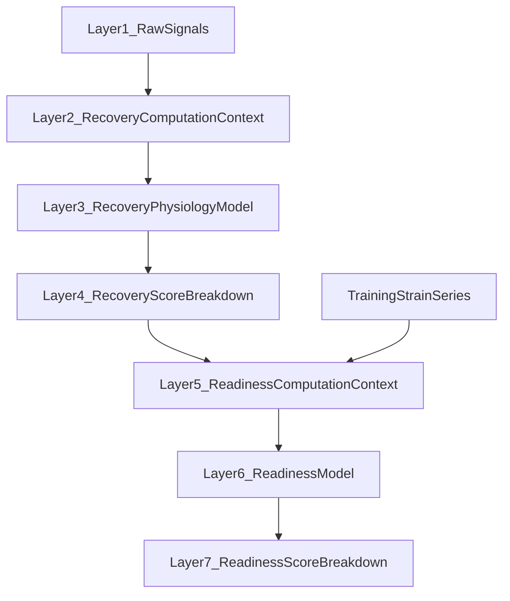

# Better pipeline — Recovery and Readiness (7 layers)

Reference diagram (saved with project assets): [`image-a2b0e4d9-ba15-4dbc-91d0-3dbed8be065a.png`](/Users/vincentleong/.cursor/projects/Users-vincentleong-Library-Mobile-Documents-com-apple-CloudDocs-Xcode-Nutrivance/assets/image-a2b0e4d9-ba15-4dbc-91d0-3dbed8be065a.png) — same structure as below.

## Layer 1 — Raw signals (inputs)

| Stream | Source (conceptual) |
|--------|---------------------|
| HRV | Effect HRV + overnight / daily series already in engine |
| RHR | Basal sleeping HR + daily resting minimum |
| Sleep | Anchored duration + efficiency (existing sleep analysis) |
| Circadian | Bedtime variance over rolling window (existing circular SD) |
| Secondary vitals | Respiratory rate, SpO2, wrist temperature vs **personal** rolling baseline (not population constants) |
| Baselines | Per-signal 7d (and optionally 28d) mean, SD (floored), sample count **N** |

No scoring at this layer — only typed, normalized-day maps.

## Layer 2 — [`RecoveryComputationContext`](Nutrivance/RecoveryReadinessPipeline.swift)

Single **Sendable** snapshot per refresh, built in `make(engine:)`:

- **Core slot**: everything needed to build [`ProRecoveryInputs`](Nutrivance/HealthStateEngine.swift) / sleep gate (today’s raw sleep path stays as already fixed in code).
- **Secondary maps**: `respiratoryRate`, `spO2`, `wristTemperature` keyed by `startOfDay`.
- **Precomputed baselines**: nested struct `PerSignalBaseline` with `mean`, `sd`, `sampleCount` for each stream used in Layer 3 (reuse patterns near [`HealthStateEngine`](Nutrivance/HealthStateEngine.swift) ~1365 `avg(..., days:)` or formalize as `RollingBaselineStats`-like).

[`RecoveryScoreView.buildSnapshots`](Nutrivance/RecoveryScoreView.swift) stops passing three parallel dictionaries; the detached task receives only `context` + fallbacks.

## Layer 3 — [`RecoveryPhysiologyModel.swift`](Nutrivance/RecoveryPhysiologyModel.swift) (new)

Pure functions, testable, no SwiftUI:

1. **Core score** — existing [`proRecoveryScore(from:)`](Nutrivance/HealthStateEngine.swift) on `ProRecoveryInputs` (HRV + RHR composite + sleep primary + efficiency cap + circadian penalty). This remains the autonomic + sleep backbone.
2. **Secondary adjustment** — for each of RR, SpO2, temp: compute z-residual vs Layer-2 baseline; map to a **small** point delta; **sum of secondary deltas capped at ±6** points total (diagram spec); each signal **gated off** unless `N ≥ 5` and variance above a floor (avoid noise).
3. **Agreement bonus** — optional **+2** only if core is in a “green” band (threshold TBD, e.g. ≥ 72) **and** all present secondaries agree (no adverse z beyond epsilon). Never applied if sleep/HRV confidence is low.

Output is **not** only a `Double` — it feeds Layer 4.

## Layer 4 — `RecoveryScoreBreakdown` + `sharedRecoveryScoreDetailed()`

New types (location: [`RecoveryReadinessPipeline.swift`](Nutrivance/RecoveryReadinessPipeline.swift) or small `RecoveryScoreTypes.swift`):

- `score: Double` (0–100) after core + secondary + agreement.
- `confidence01: Double` — down-weights or flags UI when **HRV or sleep** missing/implausible; drives Layer 6.
- `coverage: [Signal: CoverageState]` — used / imputed / missing for the seven signal families.
- `components: [RecoveryComponent]` — normalized contribution per signal for [`makeRecoverySignals`](Nutrivance/RecoveryScoreView.swift) and hero copy.

**`sharedRecoveryScore(for:)`** becomes a thin wrapper returning `breakdown?.score` for backward compatibility; primary API is **`sharedRecoveryScoreDetailed(for:context:)`**.

Persist via extended [`RecoverySnapshotDisk`](Nutrivance/RecoveryScoreView.swift) / Codable mirrors (version field if needed for migration).

## Layer 5 — `ReadinessComputationContext` (new)

Readiness does **not** re-interpret raw HRV/sleep for recovery; it consumes:

- **Sealed recovery** — `RecoveryScoreBreakdown` for anchor day (and optionally prior days if you extend the readiness window).
- **Training / load** — reuse existing [`sharedDailyLoadSnapshots`](Nutrivance/RecoveryReadinessPipeline.swift) / ACWR, strain, session history already used in [`ReadinessCheckView.buildSnapshot`](Nutrivance/ReadinessCheckView.swift).
- **Context signals** (optional, phased): nutrition timing, travel, altitude, illness flags — only wire when [`HealthStateEngine`](Nutrivance/HealthStateEngine.swift) (or related stores) exposes stable booleans or enums; otherwise stub with `.unavailable` so Layer 6 does not crash.

## Layer 6 — Readiness model

- **Recovery term** — weighted by `recovery.confidence01` (low confidence → partial weight on recovery so strain/context do not over-dominate a guess).
- **Load balance** — ACWR curve with **0.8–1.3** optimal progressive-overload window (align copy with existing pro-athlete thresholds where possible).
- **Context modifiers** — multiplicative soft factors (altitude, illness floor caps readiness ceiling, etc.).

Implement as pure functions next to existing [`proReadinessScore`](Nutrivance/HealthStateEngine.swift) or replace internally once parity-tested.

## Layer 7 — `ReadinessScoreBreakdown` + `sharedReadinessScoreDetailed()`

- `score`, `trainingZone` (or recommended intensity band), `limitingFactor` (enum — recovery vs load vs context), `confidence01` propagated from recovery + load coverage.

[`ReadinessCheckView`](Nutrivance/ReadinessCheckView.swift) hero and driver cards read from breakdown components instead of recomputing opaque doubles.

## In-app documentation (required when implementing)

User-visible explanations must stay aligned with the math. Update both files in the **same PR / pass** as the pipeline, not as a follow-up.

### [`ReadinessCheckView.swift`](Nutrivance/ReadinessCheckView.swift)

- **`MetricSectionGroup(title: "How It Is Built")`** — [`readinessDriverCards`](Nutrivance/ReadinessCheckView.swift) / [`makeReadinessDriverCards`](Nutrivance/ReadinessCheckView.swift): card titles, detail strings, and any `contribution` fields should reflect **Layer 6–7** (readiness breakdown): recovery term scaled by `confidence01`, strain drag, HRV trend support, and (when shipped) limiting factor / context modifiers. Add or swap cards if the model exposes new dimensions (e.g. confidence strip, “recovery data quality”).
- **“Signal Breakdown”** — especially the **Recovery Reserve** [`HealthCard`](Nutrivance/ReadinessCheckView.swift) subtext (Effect HRV z, RHR penalty z, sleep ratio, circadian penalty): extend or replace with **sealed recovery** summary from `RecoveryScoreBreakdown` (core vs secondary adjustment, coverage, `confidence01`) once Layer 4 exists, so this section does not contradict the new pipeline.
- **Readiness hero / tuning captions** — if the headline readiness uses `ReadinessScoreBreakdown`, any prose that describes “how today’s score is built” should mention **recovery confidence** weighting when applicable.

### [`RecoveryScoreView.swift`](Nutrivance/RecoveryScoreView.swift)

There is no section titled “How It Is Built” today; **either** add a **`MetricSectionGroup(title: "How It Is Built")`** (for parity with Readiness) summarizing Layers 2–4 in plain language, **or** expand existing blocks so they are equally explicit:
- **Recovery Score** [`HealthCard`](Nutrivance/RecoveryScoreView.swift) footer (currently “Today’s model inputs: HRV z …”) — replace with breakdown-driven lines: core autonomic + sleep gate, secondary vitals cap (±6), agreement bonus when applicable, **`confidence01`** and missing-signal callouts.
- **“Fitness Recovery Signals”** — once [`makeRecoverySignals`](Nutrivance/RecoveryScoreView.swift) uses real `components`, ensure each card’s **detail** string states how that signal enters the score (not generic placeholder text).
- **“Context”** (respiratory / SpO2 / wrist temp) — today’s copy says these metrics **do not** directly create the score; **rewrite** after Layer 3 so descriptions match reality (personal baseline, gating, capped influence).

## Implementation phasing

| Phase | Deliverable |
|-------|--------------|
| A | Layers 2–4 + RecoveryScoreView + engine alignment; **RecoveryScoreView “How it is built” / hero / Context copy**; tests for recovery |
| B | Layers 5–7 + ReadinessCheckView; **ReadinessCheckView “How It Is Built” + Signal Breakdown copy**; readiness tests |
| C | Context flags (illness, travel, altitude, nutrition) as data becomes available |

## Out of scope (unless added later)

- ML-learned weights from outcomes.
- Changing HK fetch contracts (keep `ensureRecoveryMetricsCoverage`).

## Deprecated by this plan

- Placeholder contributions in [`makeRecoverySignals`](Nutrivance/RecoveryScoreView.swift) (e.g. respiratory from `bedtimeVarianceMinutes`).
- Parallel “three dictionaries” threading in `computeSnapshots` once context embeds vitals.
